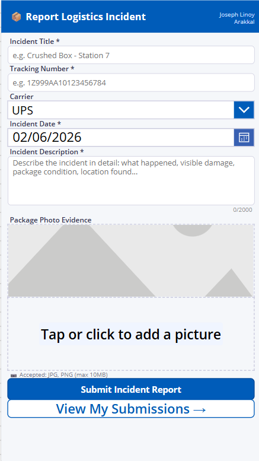
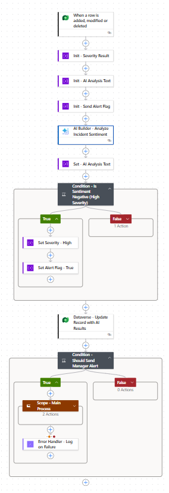
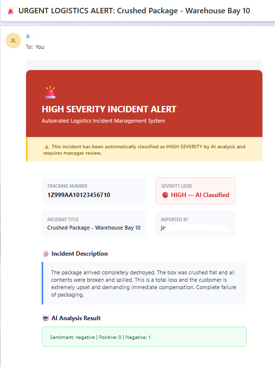

# 🚚 Intelligent Logistics Incident Management Platform

> An automated system that lets warehouse staff report damaged packages via a mobile app, uses AI to grade how bad the damage is, and instantly emails managers if it's a high-severity incident.

---

## 📸 See It In Action

### 1. Mobile Incident Reporter (Canvas App)
*Warehouse staff submit details and photos right from the warehouse floor.* 

### 2. AI & Routing Engine (Power Automate)
*The backend flow processes the data and grades the severity without any human intervention.* 

### 3. Executive Alert (Outlook/Teams)
*Managers receive instant, intelligently routed HTML alerts for severe issues.* 

---

## ⚙️ How It Works (The Architecture)

This system is completely serverless and event-driven:
1. **Data Entry:** A worker logs a damaged package using the **Power Apps** mobile app.
2. **Storage:** The record is securely saved into **Microsoft Dataverse**.
3. **Trigger:** The new database entry automatically wakes up a **Power Automate** cloud flow.
4. **AI Analysis:** The flow sends the incident description to **AI Builder (Sentiment Analysis)**. The machine learning model reads the text and assigns a mathematical score based on how negative/severe the language is.
5. **Notification:** If the AI score crosses the "High Severity" threshold, the flow generates a custom HTML email and routes it to management via **Outlook**.

---

## 🌟 Why This Matters (Business Impact)

* **Removes Human Bias:** Instead of workers guessing if an incident is "Medium" or "High" priority, the AI standardizes the grading process based on the actual facts reported.
* **Zero Lag Time:** In logistics, every minute a broken package sits on the floor costs money. This system alerts managers the exact second a severe incident is logged so they can take action.
* **Highly Scalable:** Built on Dataverse and the Power Platform ecosystem, this architecture can easily scale from a single warehouse to a global supply chain without needing to rebuild the underlying code.

---

## 🛠️ Tech Stack & Key Developer Solutions

**Technologies Used:** Power Apps Canvas, Microsoft Dataverse, Power Automate, AI Builder, HTML/CSS.

**Technical Roadblocks Overcome:**
* **Bypassed AI Array Loops:** Prevented Power Automate from creating accidental `For each` loops by isolating the string variables from the AI Builder array output.
* **Dataverse Schema Mapping:** Mapped backend, locked Logical Names (e.g., `cr4ea_packagedescription`) directly to Power Automate APIs to ensure reliable data retrieval, bypassing front-end display name errors.
* **Email Client CSS Rendering:** Engineered a custom, Outlook-safe HTML template using nested tables and inline hex codes to bypass corporate email security blocks that strip modern CSS.
